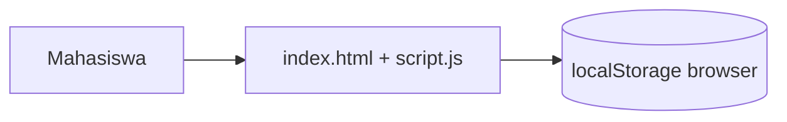
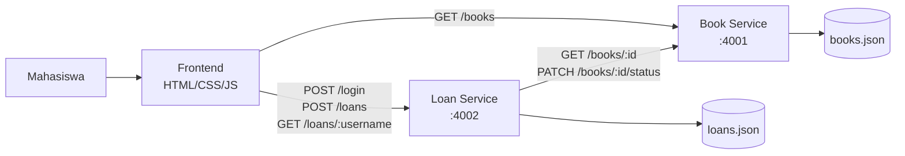

# Architecture

## Sebelum (Praktikum RE dengan AI — Pertemuan 2)

Aplikasi single-page, semua logika ada di satu file `script.js`, data disimpan
di `localStorage` browser (tidak ada backend/server).

Keterbatasan: data hanya tersimpan di satu browser, tidak bisa diakses dari
perangkat lain, dan tidak ada pemisahan tanggung jawab antar bagian sistem.

## Sesudah (Microservice)

Dipecah menjadi 2 service independen yang saling berkomunikasi lewat REST API,
plus frontend yang memanggil kedua service tersebut.

## Tanggung Jawab Tiap Service

**Book Service** (`:4001`)
- Sumber kebenaran (source of truth) untuk data buku dan status ketersediaannya.
- Tidak mengetahui apa pun tentang mahasiswa atau aturan peminjaman.

**Loan Service** (`:4002`)
- Mengelola login mahasiswa (sederhana, tanpa password sesuai batasan tugas).
- Mencatat transaksi peminjaman dan menghitung tanggal jatuh tempo.
- Menegakkan aturan bisnis: maksimal 3 buku aktif per mahasiswa.
- Berkomunikasi ke Book Service untuk mengecek dan mengubah status buku —
  Loan Service **tidak menyimpan salinan status buku sendiri**, supaya
  status ketersediaan buku hanya punya satu sumber kebenaran (Book Service).

## Alasan Pemisahan Ini
Dipisah berdasarkan **domain tanggung jawab**: "data buku" dan "proses peminjaman"
adalah dua hal yang berbeda dan bisa berubah/dikembangkan secara terpisah
(misalnya nanti Book Service bisa dikembangkan untuk menangani kategori buku,
sementara Loan Service bisa dikembangkan untuk menangani denda keterlambatan,
tanpa saling mengganggu).
